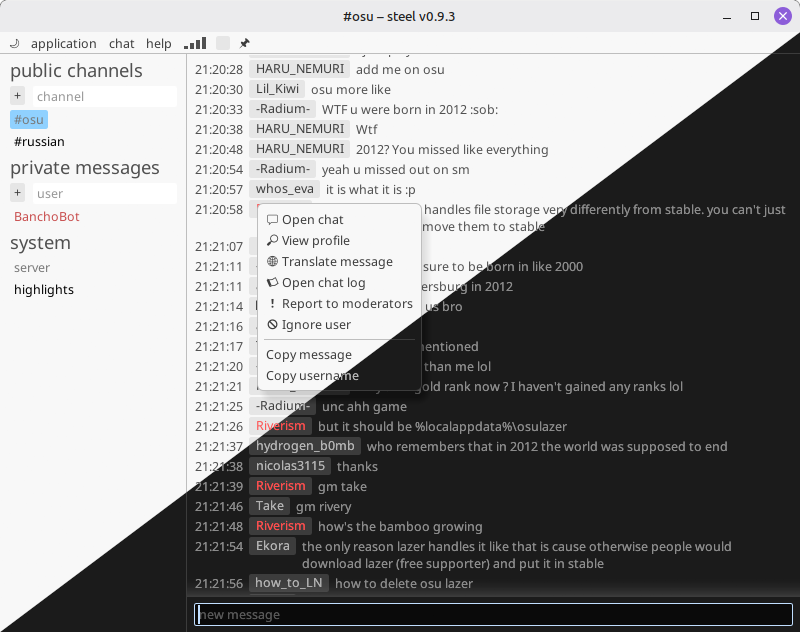

# steel



## what?

`steel` is a text chat client tailored to osu!, which provides the following features below the bare minimum ("send and receive messages"):

- custom, trackable chat highlights
- favourite channel list
- a Google Translate shortcut on chat messages
- a slightly customizable UI palette

## where?

[download the latest version](https://github.com/TicClick/steel/releases/latest) and extract it into a separate folder. enable automatic updates for better experience.

## dependencies

see [DEVELOPMENT.md](./DEVELOPMENT.md) if you want to build it from source.

### Windows/macOS

should work out of the box, provided you have OpenGL installed.

### Linux

(you probably have all of this already)

```
libasound.so.2
libssl.so.3
libcrypto.so.3
libgcc_s.so.1
libm.so.6
libc.so.6 # v2.39+
```

## FAQ

### is it cross-platform?

yes, with Windows/Linux/MacOS support.

### is it malware? my antivirus says so

one of the heuristics is [probably overly cautious](https://www.elevenforum.com/t/wacatac-h-ml-found-by-microsoft-defender-but-not-anything-else.13702/), since it can't verify who built the executable. whitelist the application, and both of you should be fine ([see example for Windows Defender](media/github-assets/whitelist-guide.png) -- also note the `!ml` suffix, which means "machine learning").

### I found an issue!

https://github.com/TicClick/steel/issues is the place.

### what's the chat transport?

you have two options:

- [IRC](https://osu.ppy.sh/wiki/IRC)
- [Websocket API](https://docs.ppy.sh)

### will you know my password?

- **IRC**: no. it's stored locally and only sent to the chat server -- see the source code.
  - however, since the IRC server doesn't support SSL, the password is sent in CLEAR TEXT -- if someone is spying on the network, they will be able to eavesdrop and take it.
    - on the other hand, if someone is spying on you, an exposed osu! **chat** password is one of the least concerns..
- **Websocket API**: no. instead of passwords, the osu! API accepts temporary tokens with capabilities such as "send messages as user X", provided the user X authorized the app to do so
  - there is a grey area, because by default I proxy the tokens through my server to get them to you for convenience (since I don't want you to know the analog of my app's "password"), but again, these are temporary and can be revoked.
    - if you are extra paranoid, you can [register your own API app](https://osu.ppy.sh/home/account/edit#oauth) and use its ID in my client -- that is well supported.
